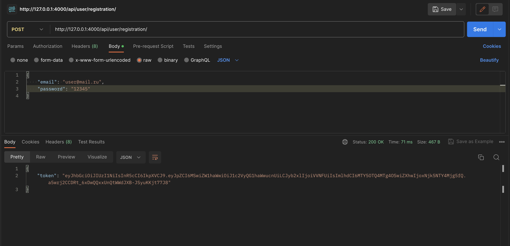
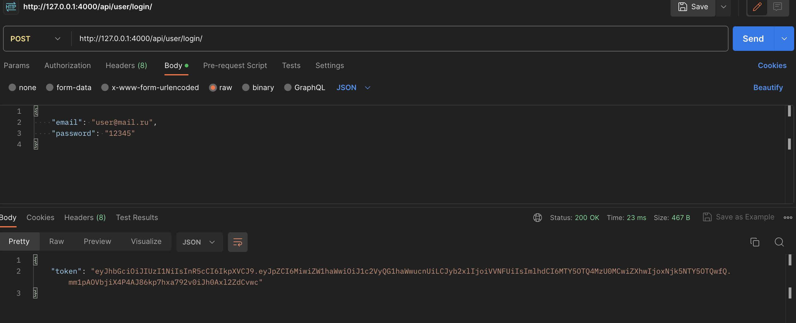
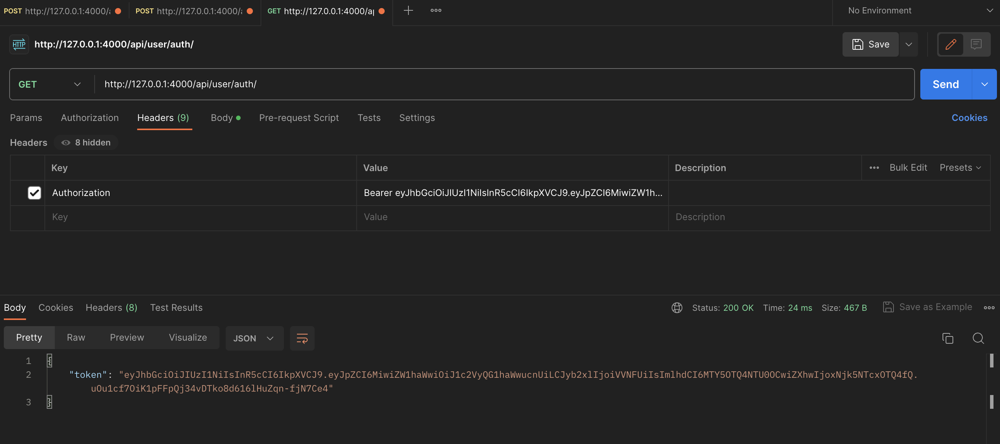

## npm run dev - запуск сервера

# localhost:4000
## /api
# routes
### post -  /user/registration
### post -  /user/login
### get  -  /user/auth

## пример: localhost:4000/api/user/auth

## registration

отправляем (например)
"email": "user@mail.ru",
"password": "12345"
в ответ получаем токен
если такой ящик уже есть будет ошибка
"message": "Пользователь с таким email уже существует"

можно посмотреть в базе данных создается ли user (если что то увидишь) (database.sqlite)

## login

логинимся
"email": "user@mail.ru",
"password": "12345"
в ответ получаем токен
если такого ящика будет ошибка
"message": "Пользователь не найден"
если неверный пароль
"message": "Указан неверный пароль"

## auth
авторизоваться

добовляем приставку Bearer затем токен
если не подходит токен
"message": "Не авторизован"